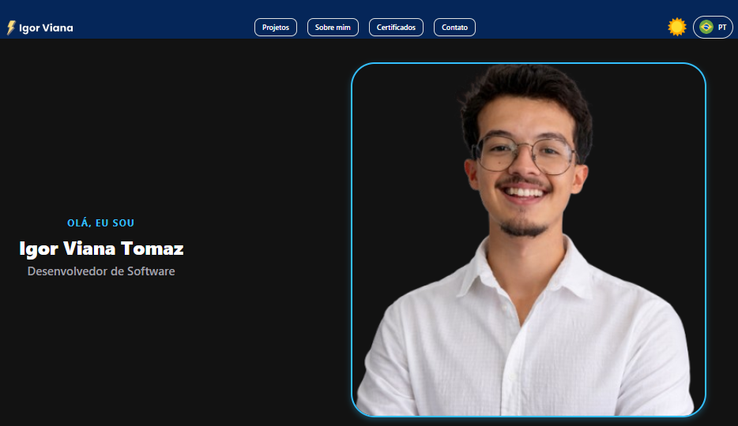

# 🚀 Portfólio - Igor Viana Tomaz

Bem-vindo ao repositório do meu portfólio pessoal! Este projeto foi desenvolvido para apresentar minha trajetória, habilidades e projetos como Desenvolvedor de Software.

A aplicação foi construída com foco em **Mobile First**, mas totalmente adaptada para **Web** (Responsivo), utilizando o poder do React Native.

<div align="center">
  
  <br><br>
  
  ## 🌐 [CLIQUE AQUI PARA ACESSAR O PORTFÓLIO ONLINE](https://igor-viana-portifolio.vercel.app/)
  <br>
</div>

## 📱 Tecnologias Utilizadas

* **React Native (Expo)**: Core da aplicação.
* **Expo Web**: Para renderização no navegador.
* **TypeScript**: Para tipagem estática e segurança do código.
* **Context API**: Gerenciamento de estado global para:
    * 🌐 **Internacionalização (i18n)**: Suporte a PT, EN e ES.
    * 🌗 **Tema**: Alternância entre Dark Mode e Light Mode.
* **Expo AV**: Player de vídeo personalizado com sincronização de legendas.

## ✨ Funcionalidades

* **Apresentação em Vídeo Interativa**: O vídeo acompanha a transcrição em tempo real, com scroll automático da legenda.
* **Multi-idioma**: Todo o conteúdo (texto e vídeo) se adapta ao idioma escolhido.
* **Temas**: Design system adaptável para modos Claro e Escuro.
* **Design Responsivo**: Layout fluido que funciona em Celulares, Tablets e Desktops.

## 🛠️ Como rodar o projeto localmente

1.  **Clone o repositório**
    ```bash
    git clone [https://github.com/igorvt23/PORTIFOLIO.git](https://github.com/igorvt23/PORTIFOLIO.git)
    cd PORTIFOLIO
    ```

2.  **Instale as dependências**
    ```bash
    npm install
    # ou
    yarn install
    ```

3.  **Execute o projeto**
    ```bash
    npx expo start
    ```
    * Pressione `w` para abrir no navegador.
    * Pressione `a` para abrir no emulador Android.
    * Pressione `i` para abrir no simulador iOS.

## 📬 Contato

<div align="center">
  <a href="https://www.linkedin.com/in/igor-viana-tomaz-080583238" target="_blank">
    
  </a>
  <a href="https://www.instagram.com/_hey.igors" target="_blank">
    
  </a>
</div>

<br>

* **Email**: igorvianat@gmail.com

---
<div align="center">
  Desenvolvido com ⚡ por Igor Viana Tomaz
</div>
